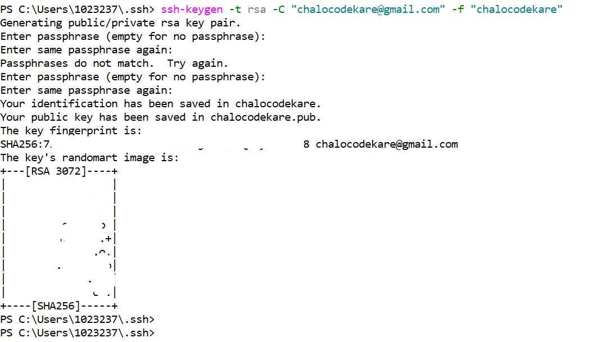
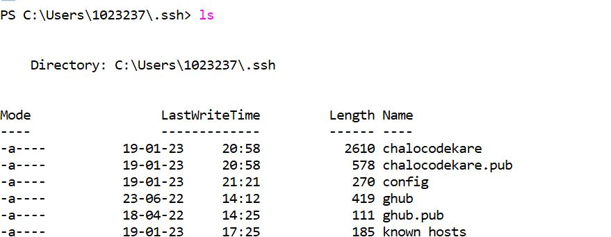
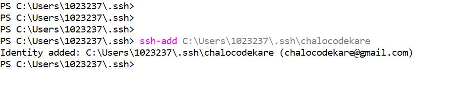
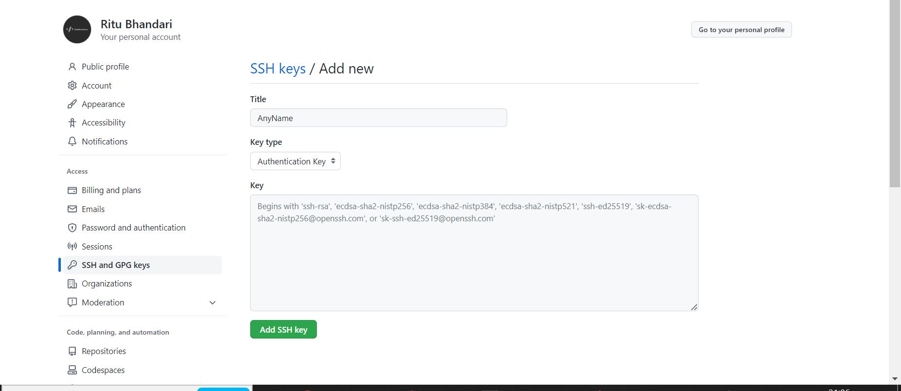
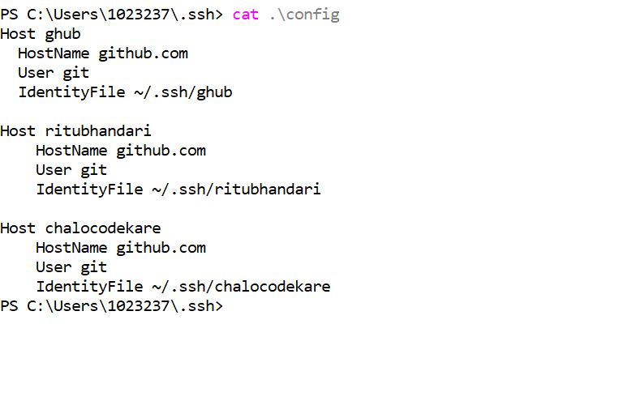

# How to work with multiple Github Accounts on a single Machine

Suppose I have two accounts, 
 - **https:/<span></span>/github.com<span></span>/chalokodekare**
 - **https:/<span></span>/github.com<span></span>/ritubhandari**

I would configure my system with both the accounts so that I can work on my official and personal projects both.

To do this, follow the below steps

### 1. Generate SSH keys for all the accounts

```sh
     cd ~/.ssh
```

```sh
     ssh-keygen -t rsa -C "chalocodekare@gmail.com" -f "chalocodekare"
     ssh-keygen -t rsa -C "ritubhandari@gmail.com" -f "ritubhandari"
```
here,

- **-C** is for adding a comment, it can be anything, but it will be helpful to know the email associated with your account.
- **-f** is to define a filename, and creating a key with a descriptive name will help you remember which key is used for which user

After entering the command the terminal will ask for passphrase, leave it empty and proceed.



> Now in .ssh folder, a public and a private key will be generated.
> Public key will have an extension __.pub__ and private key will be without any extension both having same name which we have passed after __-f__ option in the above command.




### 2. Add SSH keys to SSH Agent

We will add above generated keys to ssh-agent.
```sh
     ssh-add ~/.ssh/chalocodekare
     ssh-add ~/.ssh/ritubhandari
```
     after writing ssh-add ~/.ssh/chalocodekare, hit tab button and it'll take full system path of the file.



### 3. Add SSH public key to the Github
Now we need to add our public keys to corresponding github accounts.

__1. Copy the public key__

```sh
     cat ~/.ssh/chalocodekare.pub & copy the content
     cat ~/.ssh/ritubhandari.pub & copy the content
```


__2. Paste the public key in Github__

* Do this for each key/account one by one.
* Sign in to corresponding Github account.
* Go to **Settings** > **SSH and GPG keys** > **New SSH Key**
* Paste respective copied public key content. Title can be of your choice.
  


### 4. Create or Edit Config File and Make Host Entries

In .ssh folder, look for config file.
If **config** file doesn't exist then create one (make sure to be in **~/.ssh** directory)

```sh
     touch config (create this file however you want)
```

```sh
     open config (open it in edit mode however you want)
```

Add below lines in config file.
```config
     Host chalocodekare
         HostName github.com
         User git
         IdentityFile ~/.ssh/chalocodekare
    
     Host ritubhandari
         HostName github.com
         User git
         IdentityFile ~/.ssh/ritubhandari
```


### 5. Clone GitHub repositories using different accounts

Now to clone https://github.com/chalokodekare/work-with-multiple-github-accounts.git, we can use any account:

 ```git
     git clone {your-host-in-config-file}:{owner-user-name}/{the-repo-name}.git

     [e.g.] git clone chalocodekare:chalokodekare/work-with-multiple-github-accounts.git
         or git clone ritubhandari:chalokodekare/work-with-multiple-github-accounts.git
 ```


## 6. Configure User Name & Email

To make sure our commits in each repository uses the correct GitHub user — we will have to configure **user.email** and **user.name** in all existing or newly cloned repositories.

```git
     git config user.email "chalocodekare@gmail.com"
     git config user.name "Chalo Code Kare"
     
     or 
     git config user.email "ritubhndari@gmail.com"
     git config user.name "Ritu Bhandari"
     
     depending on which account you're using.
```
Pick the correct pair for your repository accordingly.


Now you can use:
```git
     git push
     
     git pull
```

## 7. Verify remote
To verify if your remote is pointing correctly, you can do:
```
    git remote -v
```


remove & add correct remote if incorrect.
